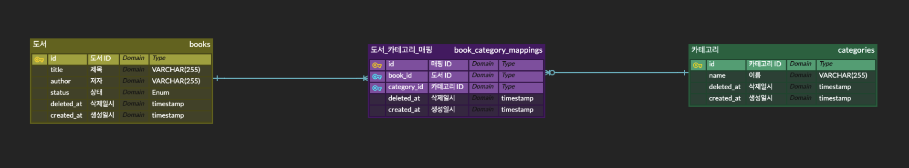

# 프로젝트 
- Library API 
  - 도서 관리 장부 디지털 시스템 전환 프로젝트 

# 기능 요구사항 
- 도서 검색 
  - 카테고리 별로 도서를 검색할 수 있다 
  - 지은이 와 제목으로 도서를 검색할 수 있다 
- 도서 등록 
  - 최소 하나 이상의 카테고리와 함께 신규 도서를 등록한다
- 도서 변경
  - 도서는 카테고리를 변경할 수 있다.
- 도서 대여
  - 도서는 대여할 수 있다
  - 도서는 훼손된 경우 대여할 수 없다 
  - 도서는 분실된 경우 대여할 수 없다
- 카테고리 검색
  - 모든 카테고리를 조회할 수 있다.

# ERD 

